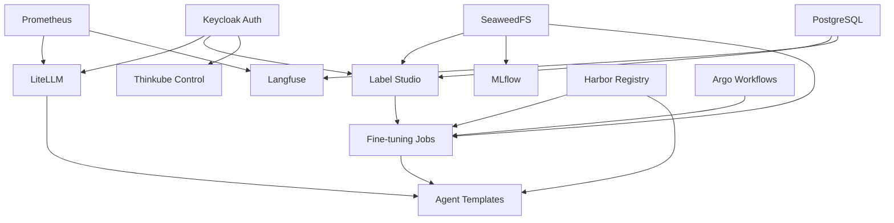

# Implementation Roadmap - MVP Critical Services

## Phase 1: Foundation Fixes (Week 1)

### Day 1: Installer Bug Fix
**Task**: Remove obsolete LXD VM detection
**Files to modify**:
- `/thinkube/installer/backend/app/api/system.py`

**Changes needed**:
```python
# Remove lines 812-827 that check for LXD VMs
# Remove references to tkc, tkw1, dns1
# Update detection logic to check for MicroK8s directly
```

**Testing**:
- Run installer on clean system
- Run installer on system with existing MicroK8s
- Verify correct detection

---

### Days 2-3: Optional Services UI
**Task**: Add UI in thinkube-control for optional service installation

**Components to create**:
1. **Backend API endpoint** (`/thinkube-control/backend/app/api/services.py`):
   ```python
   @router.post("/services/{service_name}/install")
   async def install_service(service_name: str, config: ServiceConfig):
       # Trigger Ansible playbook
       # Track installation status
       # Return deployment ID
   ```

2. **Frontend UI** (`/thinkube-control/frontend/src/views/OptionalServices.vue`):
   - List available services from `/ansible/40_thinkube/optional/`
   - Show install/uninstall buttons
   - Display configuration forms for each service
   - Real-time installation progress

3. **Service definitions** (`/thinkube-control/backend/app/data/optional_services.yaml`):
   ```yaml
   services:
     litellm:
       name: "LiteLLM Gateway"
       description: "Unified API for external AI providers"
       playbook: "ansible/40_thinkube/optional/litellm/10_deploy.yaml"
       config:
         - name: api_keys
           type: secret
           required: false
   ```

---

### Days 4-5: LiteLLM Deployment
**Task**: Create LiteLLM optional service

**Directory structure**:
```
ansible/40_thinkube/optional/litellm/
├── 10_deploy.yaml
├── 15_configure.yaml
├── 18_test.yaml
├── 19_rollback.yaml
├── templates/
│   ├── deployment.yaml.j2
│   ├── service.yaml.j2
│   ├── ingress.yaml.j2
│   └── configmap.yaml.j2
└── README.md
```

**Key configuration**:
```yaml
# deployment.yaml.j2
apiVersion: apps/v1
kind: Deployment
metadata:
  name: litellm
  namespace: ai-services
spec:
  template:
    spec:
      containers:
      - name: litellm
        image: ghcr.io/berriai/litellm:main-stable
        env:
        - name: LITELLM_MASTER_KEY
          valueFrom:
            secretKeyRef:
              name: litellm-secrets
              key: master-key
        ports:
        - containerPort: 4000
```

**Integration points**:
- Keycloak authentication
- Prometheus metrics
- API key management via secrets

---

## Phase 2: Learning Loop (Week 2)

### Days 1-2: Label Studio Deployment
**Task**: Create Label Studio optional service

**Directory structure**:
```
ansible/40_thinkube/optional/label-studio/
├── 10_deploy.yaml
├── 18_test.yaml
├── templates/
│   ├── deployment.yaml.j2
│   ├── postgres.yaml.j2
│   └── ingress.yaml.j2
└── README.md
```

**Key features**:
- PostgreSQL backend (dedicated instance)
- SeaweedFS integration for data storage
- Keycloak SSO via OIDC
- Project templates for common annotation tasks

---

### Days 3-5: Fine-tuning Infrastructure
**Task**: Create Unsloth base image and template

**1. Base image** (`/ansible/40_thinkube/core/harbor/base-images/ai-training-base.Dockerfile.j2`):
```dockerfile
FROM nvidia/cuda:12.1.0-cudnn8-devel-ubuntu22.04

# Install Python and dependencies
RUN apt-get update && apt-get install -y \
    python3.11 python3-pip git wget

# Install Unsloth
RUN pip install "unsloth[colab-new] @ git+https://github.com/unslothai/unsloth.git"
RUN pip install --no-deps trl peft accelerate bitsandbytes

# Install additional training tools
RUN pip install wandb tensorboard datasets
```

**2. Template** (`/tkt-fine-tuning/`):
```yaml
# manifest.yaml
apiVersion: v1
kind: ThinkubeTemplate
metadata:
  name: fine-tuning
  description: "Fine-tune LLMs with your data"
parameters:
  - name: model_name
    description: "Base model to fine-tune"
    type: select
    options:
      - "unsloth/llama-3-8b-bnb-4bit"
      - "unsloth/mistral-7b-v0.3-bnb-4bit"
  - name: dataset_source
    type: select
    options:
      - "label-studio"
      - "huggingface"
      - "upload"
```

---

## Phase 3: Agent Capabilities (Week 3)

### Days 1-3: LangChain Integration
**Task**: Add LangChain to base images

**Update** (`/ansible/40_thinkube/core/harbor/base-images/ai-inference-base.Dockerfile.j2`):
```dockerfile
# Add to existing ai-inference-base image
RUN pip install \
    langchain \
    langchain-community \
    langgraph \
    langchain-openai \
    chromadb \
    semantic-router
```

---

### Days 4-5: Agent Template
**Task**: Create LangChain agent template

**Template structure** (`/tkt-langchain-agent/`):
```
tkt-langchain-agent/
├── manifest.yaml
├── backend/
│   ├── app.py           # FastAPI server
│   ├── agent.py         # LangChain agent definition
│   ├── tools.py         # Custom tools
│   └── requirements.txt
├── frontend/
│   └── index.html       # Simple chat UI
└── k8s/
    ├── deployment.yaml.j2
    └── service.yaml.j2
```

**Example agent with tools**:
```python
# agent.py
from langchain.agents import create_react_agent
from langchain_openai import ChatOpenAI
from langchain.tools import Tool

class ThinkubeAgent:
    def __init__(self):
        self.llm = ChatOpenAI(
            base_url="http://litellm.ai-services.svc.cluster.local:4000",
            api_key=os.getenv("LITELLM_API_KEY")
        )

        self.tools = [
            Tool(
                name="search",
                func=self.search_knowledge_base,
                description="Search the knowledge base"
            ),
            Tool(
                name="execute_code",
                func=self.execute_code,
                description="Execute Python code"
            )
        ]

        self.agent = create_react_agent(
            self.llm,
            self.tools,
            prompt=AGENT_PROMPT
        )
```

---

## Phase 4: Testing & Integration (Week 4)

### Days 1-2: Integration Testing
**Create test suite** (`/tests/integration/`):
```python
# test_ai_pipeline.py
def test_complete_ai_workflow():
    """Test the complete AI feedback loop"""

    # 1. Call external model via LiteLLM
    response = litellm_client.complete("gpt-4", "Test prompt")
    assert response.status_code == 200

    # 2. Create annotation task in Label Studio
    project = label_studio.create_project("Test Project")
    task = project.create_task(response.text)

    # 3. Trigger fine-tuning job
    job = fine_tuning.start_job(
        model="llama-3-8b",
        dataset=project.export()
    )

    # 4. Deploy agent with fine-tuned model
    agent = deploy_agent(model=job.output_model)

    # 5. Test agent with tools
    result = agent.run("Use search to find information")
    assert "search" in result.tool_calls
```

### Days 3-4: Documentation Updates
**Update documentation**:
- Add service installation guide
- Create agent development tutorial
- Document fine-tuning workflow
- Update architecture diagrams

### Day 5: Bug Fixes & Polish
- Address issues found in testing
- Performance optimization
- UI/UX improvements

---

## Service Dependency Graph



---

## Configuration Management

### Environment Variables Template
```yaml
# /inventory/group_vars/all/ai_services.yaml
ai_services:
  litellm:
    enabled: true
    master_key: "{{ vault_litellm_master_key }}"
    providers:
      openai:
        api_key: "{{ vault_openai_api_key }}"
      anthropic:
        api_key: "{{ vault_anthropic_api_key }}"

  label_studio:
    enabled: true
    postgres_password: "{{ vault_label_studio_db_password }}"

  fine_tuning:
    wandb_api_key: "{{ vault_wandb_api_key }}"
    huggingface_token: "{{ vault_hf_token }}"
```

---

## Monitoring & Observability

### Key Metrics to Track
1. **LiteLLM**:
   - Requests per second by provider
   - Token usage and costs
   - Error rates by model
   - Response latency

2. **Label Studio**:
   - Annotations per hour
   - Active projects
   - Storage usage
   - User activity

3. **Fine-tuning**:
   - Job success rate
   - Training time
   - GPU utilization
   - Model performance metrics

4. **Agents**:
   - Tool usage frequency
   - Success rate by task type
   - Context window usage
   - Reasoning chain length

---

## Rollback Procedures

Each service includes a rollback playbook:
```yaml
# 19_rollback.yaml example
- name: Rollback LiteLLM deployment
  hosts: microk8s_control_plane
  tasks:
    - name: Scale down deployment
      kubernetes.core.k8s_scale:
        name: litellm
        namespace: ai-services
        replicas: 0

    - name: Restore previous version
      kubernetes.core.k8s:
        state: present
        definition: "{{ lookup('file', 'backups/litellm-previous.yaml') }}"

    - name: Verify rollback
      uri:
        url: "https://litellm.{{ domain_name }}/health"
        status_code: 200
```

---

## Success Criteria

### Week 1 Complete When:
- [ ] Installer correctly detects MicroK8s
- [ ] Optional services UI displays all services
- [ ] LiteLLM responds to API calls

### Week 2 Complete When:
- [ ] Label Studio accepts annotations
- [ ] Fine-tuning job completes successfully
- [ ] Model saved to registry

### Week 3 Complete When:
- [ ] Agent uses tools correctly
- [ ] Agent maintains context
- [ ] Agent deployed via template

### Week 4 Complete When:
- [ ] All integration tests pass
- [ ] Documentation complete
- [ ] Demo video recorded

---

## Notes

- Keep changes minimal and focused
- Test each component in isolation first
- Document all API endpoints
- Create runbooks for common issues
- Set up monitoring before deployment
- Use feature flags for gradual rollout