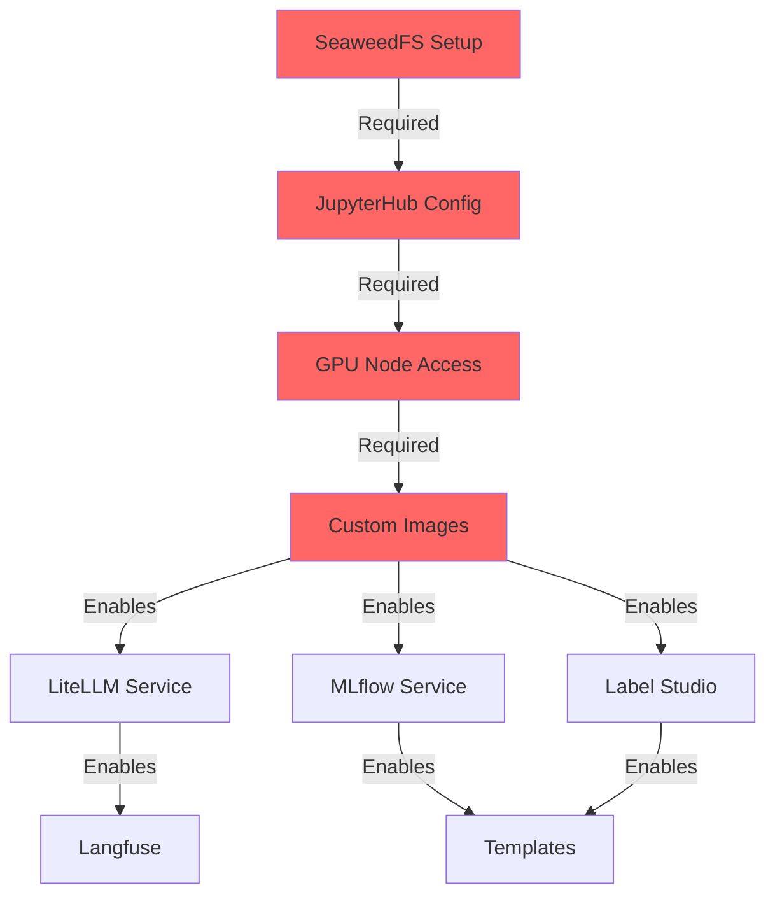

# MVP Final Implementation Plan - JupyterHub First Strategy

## 🎯 CURRENT STATUS (Last Updated: Sept 30, 2025)

**MVP Progress: 93% Complete**

✅ **Phase 1 (JupyterHub):** COMPLETE
✅ **Phase 2 (Docker Images):** COMPLETE
✅ **Phase 3 (Core Services):** COMPLETE (LiteLLM, MLflow, CVAT, Argilla)
✅ **Phase 4 (Supporting):** COMPLETE (Qdrant, Langfuse, NATS all deployed)
❌ **Phase 5 (Templates):** NOT STARTED

**Remaining Work:**
1. Create production templates (tkt-langchain-agent, tkt-fine-tuning-job)

## Executive Summary

This is the authoritative MVP implementation plan for Thinkube, consolidating all gap analyses and prioritizing JupyterHub enhancements as the critical foundation. JupyterHub with GPU flexibility represents the most complex technical challenge with no existing examples, making it the logical starting point.

**Core Strategy:** Build the hardest part first (JupyterHub GPU flexibility), then layer standard services on top.

**Implementation Status:** The critical foundation (JupyterHub GPU flexibility + SeaweedFS) was completed on Sept 27, 2025. Core AI services (LiteLLM, MLflow, CVAT, Argilla) are deployed and operational. Only supporting services (Langfuse, NATS) and production templates remain.

## Current State vs. Target State

### What's Already Working ✅
- Basic JupyterHub (locked to control plane)
- Harbor registry with image management
- GPU Operator functioning
- SeaweedFS deployed
- Optional Services UI in thinkube-control
- Code-server and CI/CD pipeline

### Critical Gaps to Address 🔴
1. **JupyterHub GPU Flexibility** - Cannot run notebooks on GPU nodes
2. **External AI Access** - No gateway to GPT-4/Claude
3. **Feedback Collection** - No human-in-the-loop platform
4. **Model Fine-tuning** - Cannot improve models
5. **Agent Development** - Limited to simple inference

## Implementation Strategy

### Why JupyterHub First?

1. **Maximum Complexity** - No examples of JupyterHub + SeaweedFS + multi-GPU
2. **Foundation Dependency** - Everything else builds on this
3. **Highest Risk** - If this fails, the platform fails
4. **Unique to Thinkube** - Other services have standard patterns

## Phase-by-Phase Implementation

### Phase 1: JupyterHub GPU Flexibility (Weeks 1-2) 🔴 CRITICAL START

**Goal:** Enable notebooks to run on any GPU node with persistent storage

#### Week 1: Storage Foundation
```yaml
Day 1-2: SeaweedFS Configuration
- Create jupyter-notebooks PV/PVC
- Configure ReadWriteMany access
- Test multi-node mounting

Day 3-4: JupyterHub Updates
- Remove hostPath dependencies
- Configure dynamic profiles
- Enable node selection

Day 5: Integration Testing
- Verify notebook persistence
- Test GPU scheduling
- Benchmark SeaweedFS performance
```

#### Week 2: Custom Images
```yaml
Day 1-2: Base Images
- jupyter-ml-cpu (standard ML)
- jupyter-ml-gpu (CUDA + PyTorch)

Day 3: Specialized Images
- jupyter-fine-tuning (Unsloth + QLoRA)
- jupyter-agent-dev (LangChain + CrewAI)

Day 4-5: Testing
- GPU verification
- Package compatibility
- Performance testing
```

**Deliverables:**
- ✅ Notebooks accessible from any node
- ✅ GPU resources properly allocated
- ✅ Custom images in profile selector
- ✅ SeaweedFS performance acceptable

### Phase 2: Core AI Services (Week 3) 🔴 CRITICAL

**Goal:** Deploy infrastructure services that notebooks will use

#### LiteLLM Gateway
```yaml
Location: ansible/40_thinkube/optional/litellm/
Purpose: Unified API for external models
Integration: Called from Jupyter notebooks
```

#### MLflow Tracking
```yaml
Location: ansible/40_thinkube/optional/mlflow/
Purpose: Experiment tracking and model registry
Storage: PostgreSQL + SeaweedFS
```

#### Label Studio
```yaml
Location: ansible/40_thinkube/optional/label-studio/
Purpose: Data annotation platform
Auth: Keycloak SSO integration
```

### Phase 3: Supporting Services (Week 4) 🟡 IMPORTANT

**Goal:** Add observability and coordination

#### Services to Deploy:
- **Langfuse** - LLM observability
- **NATS** - Real-time messaging
- **Qdrant** - Vector database

### Phase 4: Production Templates (Week 5) 🟢 ENHANCEMENT

**Goal:** Enable production deployment of notebook-developed code

#### Templates:
- **tkt-langchain-agent** - Deploy agents from notebooks
- **tkt-fine-tuning-job** - Run training as Argo jobs

## Complete Component Matrix

| Component | Type | Priority | Week | Dependencies | Enables |
|-----------|------|----------|------|--------------|---------|
| **SeaweedFS Notebooks** | Storage | 🔴 Critical | 1 | SeaweedFS CSI | All notebook work |
| **JupyterHub Config** | Configuration | 🔴 Critical | 1 | SeaweedFS PVC | GPU flexibility |
| **jupyter-ml-gpu** | Docker Image | 🔴 Critical | 2 | Harbor, CUDA | GPU notebooks |
| **jupyter-fine-tuning** | Docker Image | 🔴 Critical | 2 | jupyter-ml-gpu | Model training |
| **jupyter-agent-dev** | Docker Image | 🔴 Critical | 2 | jupyter-ml-cpu | Agent development |
| **LiteLLM** | Optional Service | 🔴 Critical | 3 | Kubernetes | External models |
| **MLflow** | Optional Service | 🔴 Critical | 3 | PostgreSQL | Experiment tracking |
| **Label Studio** | Optional Service | 🔴 Critical | 3 | PostgreSQL | Data annotation |
| **Langfuse** | Optional Service | 🟡 Important | 4 | PostgreSQL | Observability |
| **NATS** | Optional Service | 🟡 Important | 4 | Kubernetes | Messaging |
| **Qdrant** | Optional Service | 🟡 Important | 4 | Kubernetes | Vector search |
| **tkt-agent** | Template | 🟢 Nice | 5 | All services | Production agents |
| **tkt-fine-tuning-job** | Template | 🟢 Nice | 5 | MLflow | Batch training |

## Implementation Details by Component Type

### 1. JupyterHub Enhancement (Most Complex)

**Storage Architecture:**
```yaml
Control Plane (node1)              GPU Nodes (node2, node3)
├── shared-code (stays hostPath)   ├── JupyterHub pods run here
├── code-server ✓                  ├── Mount notebooks via SeaweedFS
└── CI/CD pipeline ✓               └── Full GPU access

SeaweedFS
└── /notebooks (ReadWriteMany) - Persistent across all nodes
```

**Profile Configuration:**
```python
# Dynamic profiles based on available resources
profiles = [
    "CPU Development (Any Node)",
    "GPU Auto-Select (Find Available)",
    "GPU on node2 (Specific)",
    "Fine-tuning with Unsloth",
    "Agent Development"
]
```

### 2. Optional Services (Standard Patterns)

**Deployment Pattern:**
```yaml
# Each service follows:
- Kubernetes Deployment
- Service + Ingress
- PostgreSQL/SeaweedFS storage
- Keycloak SSO (where applicable)
```

### 3. Custom Docker Images

**Base Image Hierarchy:**
```
harbor/cuda:12.6
  └── jupyter-ml-gpu
      ├── jupyter-fine-tuning (+ Unsloth)
      └── jupyter-inference (+ vLLM)

harbor/python:3.11
  └── jupyter-ml-cpu
      └── jupyter-agent-dev (+ LangChain)
```

### 4. Templates (Simple Wrappers)

**Purpose:** Package notebook code for production
```yaml
Notebook Development → Test → Export → Template → Production
```

## Success Metrics

### ✅ Week 1-2 Checkpoint (JupyterHub) - COMPLETE
- [x] Notebook saved on node1 accessible from node2
- [x] GPU pod scheduled successfully
- [x] Custom image available in dropdown
- [x] SeaweedFS latency < 2 seconds
- [x] Dynamic profile generation from thinkube-control
- [x] Volume mount architecture redesigned (Sept 27, 2025)

### ✅ Week 3 Checkpoint (Core Services) - COMPLETE (with modifications)
- [x] LiteLLM responds to API calls (deployed Sept 30, 2025)
- [x] MLflow tracks experiment (deployed Sept 27, 2025, migrated to SeaweedFS)
- [x] ~~Label Studio~~ → CVAT (computer vision) + Argilla (NLP/LLM) - Both with SSO working

### ✅ Week 4 Checkpoint (Supporting) - COMPLETE
- [x] Langfuse shows LLM traces (deployed Sept 30, 2025)
- [x] NATS pub/sub working (deployed Sept 30, 2025)
- [x] Qdrant stores vectors (deployed Sept 12, 2025)

### ❌ Week 5 Checkpoint (Production) - NOT STARTED
- [ ] Agent deployed from template
- [ ] Fine-tuning job completes

## Risk Analysis and Mitigation

| Risk | Impact | Probability | Mitigation |
|------|--------|-------------|------------|
| SeaweedFS performance | High | Medium | Test week 1, prepare NFS backup |
| GPU scheduling fails | High | Low | Test multiple node configurations |
| Image compatibility | Medium | Medium | Use proven base images |
| Service integration | Medium | Low | Deploy incrementally |
| License violation | High | Low | Audit all dependencies |

## Critical Path Dependencies



## All Identified Gaps (Complete List)

### Critical Gaps (Status as of Sept 30, 2025)
1. ✅ JupyterHub GPU flexibility - **COMPLETE** (Sept 27, 2025)
2. ✅ External AI provider gateway (LiteLLM) - **DEPLOYED** (Sept 30, 2025)
3. ✅ Human-in-the-loop platform - **COMPLETE** (CVAT + Argilla with SSO, Sept 30, 2025)
4. ✅ Fine-tuning toolkit (Unsloth in Jupyter) - **AVAILABLE** (tk-jupyter-ml-gpu image)
5. ✅ Agent frameworks (LangChain in Jupyter) - **AVAILABLE** (tk-jupyter-ml-cpu/gpu images)

### Important Gaps (Status as of Sept 30, 2025)
6. ✅ LLM Observability (Langfuse) - **DEPLOYED** (Sept 30, 2025)
7. ✅ Real-time messaging (NATS) - **DEPLOYED** (Sept 30, 2025)
8. ✅ ML experiment tracking (MLflow) - **DEPLOYED** (Sept 27, 2025, migrated to SeaweedFS)
9. ✅ Multi-agent orchestration (CrewAI in Jupyter) - **AVAILABLE** (in Jupyter images)

### Future Enhancements (Post-MVP)
10. ⏳ MCP Server implementation update
11. ⏳ CI/CD Monitor extension refactoring
12. ⏳ Multi-tenancy support
13. ⏳ Distributed ML framework (Ray)
14. ⏳ Simple model server (Ollama)
15. ⏳ No-code ML training (Ludwig)
16. ⏳ Semantic router improvements
17. ⏳ Advanced agent tools

## Timeline Summary

```
Week 1: JupyterHub Storage Foundation
Week 2: Custom Images and GPU Testing
Week 3: Core Services Deployment
Week 4: Supporting Services
Week 5: Production Templates
```

**Total Duration:** 5 weeks
**Critical Path:** Weeks 1-3
**Enhancement Path:** Weeks 4-5

## Key Decisions Made

1. **JupyterHub First** - Tackle complexity early
2. **SeaweedFS for Notebooks** - True multi-node access
3. **Custom Images** - Optimized for specific workloads
4. **Single-User Focus** - Avoid multi-tenant complexity
5. **Apache 2.0 Compliance** - All components compatible

## Next Steps After MVP

1. Performance optimization
2. Additional specialized images
3. Advanced templates
4. Multi-user considerations
5. Distributed training capabilities

## Conclusion

This plan prioritizes the most complex and critical component (JupyterHub GPU flexibility) first, then builds standard services on that foundation. By solving the hardest problem early, we ensure the platform can fulfill its core promise: flexible AI/ML development on any available GPU.

The innovation is making JupyterHub the center of the AI platform with true GPU flexibility, rather than treating it as an afterthought. Once notebooks can run anywhere and persist their work, adding services becomes straightforward Kubernetes deployments.

**Success Definition:** A user can start a notebook on any GPU node, fine-tune a model with Unsloth, track it with MLflow, and deploy it to production - all without leaving the Thinkube platform.

## Reference Documents

- `JUPYTERHUB_IMPLEMENTATION_PLAN.md` - Detailed JupyterHub implementation
- `JUPYTERHUB_GPU_FLEXIBILITY_PLAN.md` - GPU flexibility specifics
- Individual service documentation in `/ansible/40_thinkube/optional/`