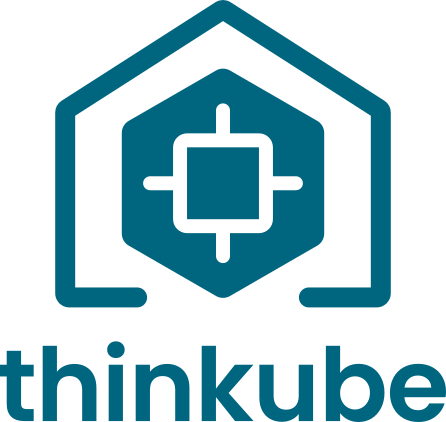

  <picture>
    <source media="(prefers-color-scheme: dark)" srcset=".github/assets/thinkube-logo-dark.svg">
    
  </picture>

<h1 align="center">Thinkube</h1>

<strong>Sovereign AI starts at your desk.</strong> 
Your hardware · your models · your data

  <a href="https://thinkube.org/thinkube-docs/install/overview.html">Install</a> ·
  <a href="https://github.com/thinkube/thinkube-installer/releases/latest">Download the installer</a> ·
  <a href="https://thinkube.org">Documentation</a> ·
  <a href="https://thinkube.zulipchat.com/">Chat</a>

A complete AI development environment on your own machines: notebooks, your
GPUs and your models, and a cluster to try what you build, all driven from a
coding agent. Models, components and services load and unload as you need
them, so your machine's limited resources go to the work you are doing now.

The base is [Thinkube Kubernetes](https://thinkube.org/thinkube-docs/kubernetes/index.html):
unmodified upstream Kubernetes on your machines, installed with kubeadm, with
identity, storage, registry, database, certificates and GPUs installed and
connected.

## Get started

1. Check what you need: the machines and four accounts —
   [Install Thinkube](https://thinkube.org/thinkube-docs/install/overview.html).
2. Download the installer for your architecture, `amd64` or `arm64`, from the
   [latest release](https://github.com/thinkube/thinkube-installer/releases/latest).
3. [Run the installer](https://thinkube.org/thinkube-docs/install/run-the-installer.html).

Thinkube has been tested on a DGX Spark and on an amd64 workstation with
RTX 3090 GPUs.

## Documentation

- [What Thinkube is](https://thinkube.org/thinkube-docs/start-here/what-is-thinkube.html)
- [Install Thinkube](https://thinkube.org/thinkube-docs/install/overview.html)
- [Playbooks](https://thinkube.org/thinkube-docs/index.html#playbooks)
- [Components catalog](https://thinkube.org/thinkube-docs/reference/components.html)

## This repository

The Ansible playbooks that install Thinkube. The
[Thinkube installer](https://github.com/thinkube/thinkube-installer) clones
this repository and runs them; they are not run by hand. There is one folder
per component in [`ansible/40_thinkube/`](ansible/40_thinkube/README.md).

## Contributing and support

- Questions: the [Thinkube Zulip chat](https://thinkube.zulipchat.com/).
- Bugs: [GitHub issues](https://github.com/thinkube/thinkube/issues). Say what
  you ran, what you expected, and what happened, in the tool's own words.

Contributions are welcome. Support is best effort.

## License

Apache License 2.0. See [LICENSE](LICENSE).

Copyright Alejandro Martínez Corriá and the Thinkube contributors.
